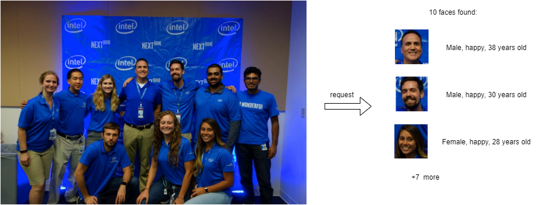
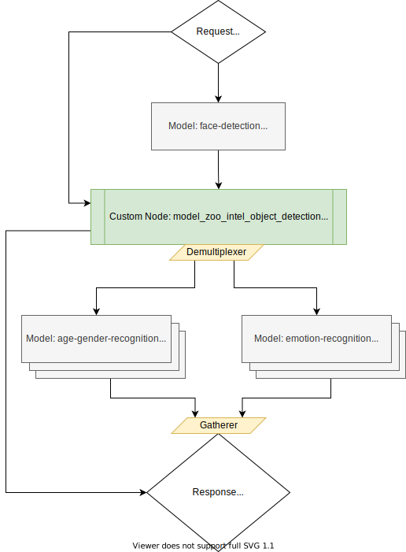

# Usage of Object Detection and Recognition models from OpenVINO Model Zoo in DAG

Reference: [Usage of Object Detection and Recognition models from OpenVINO Model Zoo in DAG](https://github.com/openvinotoolkit/model_server/blob/main/docs/faces_analysis_dag.md)

## Analysis of multiple faces in single image frame request

This document demonstrates how to create complex pipelines using object detection and object recognition models from OpenVINO Model Zoo. As an example, we will use [face-detection-retail-0004](https://github.com/openvinotoolkit/open_model_zoo/blob/2021.4/models/intel/face-detection-retail-0004/README.md) to detect multiple faces on the image. Then, for each detected face we will crop it using [model_zoo_intel_object_detection](../src/custom_nodes/model_zoo_intel_object_detection) example custom node. Finally, each image face image will be forwarded to [age-gender-recognition-retail-0013](https://github.com/openvinotoolkit/open_model_zoo/blob/2021.4/models/intel/age-gender-recognition-retail-0013/README.md) and [emotion-recognition-retail-0003](https://github.com/openvinotoolkit/open_model_zoo/blob/2021.4/models/intel/emotions-recognition-retail-0003/README.md) models.



Using such pipeline, a single request to OVMS can perform a complex set of operations to determine all faces and its properties.

## Pipeline Configuration Graph

Below is depicted graph implementing faces analysis pipeline execution.



## Starting run this example

### 1. Prepare the models from OpenVINO Model Zoo

```bash
$ mkdir models
```

#### Face detection model

```bash
$ mkdir -p models/face-detection-retail-0004/1

$ wget https://storage.openvinotoolkit.org/repositories/open_model_zoo/2021.3/models_bin/2/face-detection-retail-0004/FP32/face-detection-retail-0004.xml -P models/face-detection-retail-0004/1
$ wget https://storage.openvinotoolkit.org/repositories/open_model_zoo/2021.3/models_bin/2/face-detection-retail-0004/FP32/face-detection-retail-0004.bin -P models/face-detection-retail-0004/1
```

#### Age gender recognition model

```bash
$ mkdir -p models/age-gender-recognition-retail-0013/1

$ wget https://storage.openvinotoolkit.org/repositories/open_model_zoo/2021.3/models_bin/2/age-gender-recognition-retail-0013/FP32/age-gender-recognition-retail-0013.xml -P models/age-gender-recognition-retail-0013/1
$ wget https://storage.openvinotoolkit.org/repositories/open_model_zoo/2021.3/models_bin/2/age-gender-recognition-retail-0013/FP32/age-gender-recognition-retail-0013.bin -P models/age-gender-recognition-retail-0013/1
```

#### Emotions recognition model

```bash
$ mkdir -p models/emotion-recognition-retail-0003/1

$ wget https://storage.openvinotoolkit.org/repositories/open_model_zoo/2021.3/models_bin/2/emotions-recognition-retail-0003/FP32/emotions-recognition-retail-0003.xml -P models/emotion-recognition-retail-0003/1
$ wget https://storage.openvinotoolkit.org/repositories/open_model_zoo/2021.3/models_bin/2/emotions-recognition-retail-0003/FP32/emotions-recognition-retail-0003.bin -P models/emotion-recognition-retail-0003/1
```

### 2. Building the Custom Node "model_zoo_intel_object_detection" Library

- go to the custom node source code folder `custom_nodes/model_zoo_intel_object_detection`
- run `make` command

This command will export the compiled library in `./lib` folder. Copy this `lib` folder to the same location with previously downloaded models.

### 3. OVMS Configuration File

The configuration file for running the faces analysis demo is stored in [config.json](https://github.com/openvinotoolkit/model_server/blob/main/src/custom_nodes/model_zoo_intel_object_detection/config_faces_example.json). Copy this file along with the model files.

### 4. Deploying OVMS

Deploy OVMS with faces analysis pipeline using the following command:

```bash
$ docker run --rm -p 9000:9000 \
-v $(pwd)/models:/models \
-v $(pwd)/lib:/models/lib \
-v $(pwd)/config.json:/models/config.json \
openvino/model_server:latest \
--config_path /models/config.json \
--port 9000
```

### 5. Requesting the Service

Exemplary client [faces_analysis_pipeline_client.py](https://github.com/openvinotoolkit/model_server/blob/main/example_client/faces_analysis_pipeline_client.py) can be used to request pipeline deployed in previous step.

#### Install requirement modules

```bash
$ pip install -r client_requirements.txt
```

#### Running the client

Now you can create directory for text images and run the client:

```bash
$ mkdir results
```

```bash
$ python3 faces_analysis_pipeline_client.py \
--pipeline_name find_face_images \
--grpc_port 9000 \
--image_input_path ./images/people1.jpeg \
--face_images_output_name face_images \
--face_images_save_path ./results \
--image_width 600 \
--image_height 400 \
--input_image_layout NHWC
```

##### Output:

```bash
Output: name[genders]
    numpy => shape[(10, 1, 2, 1, 1)] data[float32]
Output: name[ages]
    numpy => shape[(10, 1, 1, 1, 1)] data[float32]
Output: name[face_images]
    numpy => shape[(10, 1, 3, 64, 64)] data[float32]
Output: name[confidence_levels]
    numpy => shape[(10, 1, 1)] data[float32]
Output: name[face_coordinates]
    numpy => shape[(10, 1, 4)] data[float32]
Output: name[emotions]
    numpy => shape[(10, 1, 5, 1, 1)] data[float32]

Found 10 faces:
Age: 36 ; Gender: male ; Emotion: happy ; Original image coordinate: [0.5524015  0.3024714  0.5912314  0.39167267]
Age: 24 ; Gender: male ; Emotion: neutral ; Original image coordinate: [0.33651015 0.6238419  0.38452235 0.7109271 ]
Age: 22 ; Gender: male ; Emotion: happy ; Original image coordinate: [0.2273316  0.34603435 0.26951137 0.44243896]
Age: 46 ; Gender: male ; Emotion: happy ; Original image coordinate: [0.44218776 0.29372305 0.48234263 0.3778239 ]
Age: 41 ; Gender: female ; Emotion: happy ; Original image coordinate: [0.51707435 0.5602793  0.56729674 0.65029866]
Age: 26 ; Gender: male ; Emotion: happy ; Original image coordinate: [0.79853094 0.35693872 0.8411772  0.42878723]
Age: 26 ; Gender: female ; Emotion: happy ; Original image coordinate: [0.6506455  0.5917437  0.69963944 0.6924231 ]
Age: 30 ; Gender: male ; Emotion: happy ; Original image coordinate: [0.67255247 0.32400367 0.72031224 0.41411582]
Age: 22 ; Gender: female ; Emotion: happy ; Original image coordinate: [0.13879137 0.3621901  0.18784638 0.45262757]
Age: 22 ; Gender: female ; Emotion: happy ; Original image coordinate: [0.33016038 0.37727407 0.36954236 0.44583443]
```
