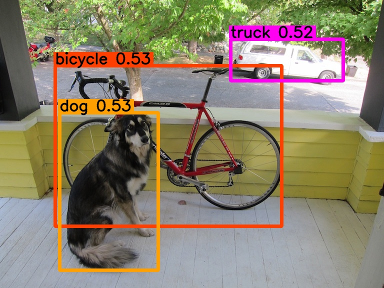

# Example client for Object Detection with YOLOv3

## 1. Download OpenVINO Model Server Docker image

```bash
$ docker pull openvino/model_server:latest
```

## 2. Download Model

Download `yolo_v3.xml` and `yolo_v3.bin`, and then move them into `model/1` folder

- [yolo_v3.xml](https://drive.google.com/file/d/1d6S7e-7XCeuSapGe0QfmJ9ZKxKJgl5S-/view?usp=sharing)
- [yolo_v3.bin](https://drive.google.com/file/d/1hQMYSRs8HygTvkHLl0Fsrb3KNavF1wC-/view?usp=sharing)

## 3. Start the Model Server Container

Start the Model Server container:

```bash
$ docker run --rm -d -p 9000:9000 \
-v $(pwd)/model:/models/yolov3 \
openvino/model_server:latest \
--model_path /models/yolov3 \
--model_name yolov3 \
--port 9000
```

### Starting Model Server Container with a Configuration File

```bash
$ docker run --rm -d -p 9000:9000 \
-v $(pwd)/model/:/models/yolov3 \
-v $(pwd)/config.json:/models/config.json \
openvino/model_server:latest \
--config_path /models/config.json \
--port 9000
```

## 4. Run Inference

### 1. Install the dependencies

```bash
$ pip3 install -r requirements.txt
```

### 2. Run the client

```bash
$ python3 object_detection.py
```

Then you would see the results in the output folder

#### Example




