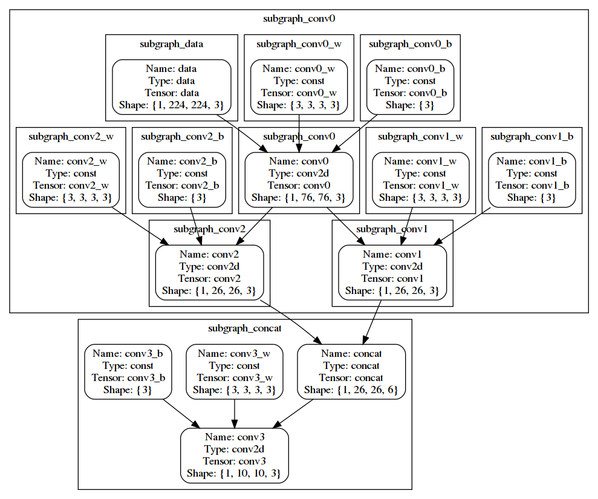

# Xilinx Intermediate Representation (XIR)

`Xilinx Intermediate Representation (XIR)` is a *graph based intermediate representation* of the AI algorithms which is well designed for compilation and efficient deployment of the `Domain-specific Processing Unit (DPU)` on the powerful FPGA platform.

XIR includes `Op`, `Tensor`, `Graph` and `Subgraph` libraries, which providing a clear and flexible representation for the computational graph.

XIR provides `in-memory format`, and `file format` for different usage.

- `In memory format XIR`: is a Graph object

    ```
    Can be serialized to a xmode
    ```

- `file format XIR`: is a `xmodel`

    ```
    Can be deserialized to the Graph object.
    ```

## Python APIs

- [PyXIR](https://github.com/Xilinx/pyxir)

It enables Python users to fully access the XIR and get benefits in the pure Python environment.

## XIR libraries

### xir::Op

`Op in XIR is the instance of the operator definition either in XIR or extended from XIR`.

*All the Op instance can only be created or added by the Graph, according to the predefined build-in/extended op definition library.*

The Op definition mainly includes the `input arguments` and `intrinsic attributes`.

Besides the intrinsic predefined attributes, an Op instance is also able to carry more `extrinsic attributes` by applying `xir::Op::set_attr API`.

#### Note:

```
Op instance can only obtain one output tensor,
but more than one fanout ops.
```

### xir::Tensor

Tensor is another important class in XIR. Not like other frameworks' tensor definition, `XIR's Tensor is only a description of the data block it represented`, but the real data block is excluded from the Tensor.

The key attributes for Tensor:

- `data type`
- `shape`

### xir::Graph

`Graph is the core component of the XIR`, and it obtains serveral significant APIs, e.g. the `xir::Graph::serialize`, `xir::Graph::deserialize` and `xir::Graph::topological_sort`.

`The Graph is like a container`, which maintains the Op as its vertex, and use the producer-consumer relation as the edge.

### xir::Subgraph

`XIR's Subgraph is a tree-like hierarchy, which divides a set of ops into serveral non-overlapping sets.`

*The Graph's entire op set can be seem as the root. And Subgraph can be nested*, but still non-overlapping. The nested insiders will be the children of the outer one.

## A short demo

[Here](https://github.com/Xilinx/Vitis-AI/blob/24858d96cfae49f895671ba0367745f0822683b6/tools/Vitis-AI-Runtime/VART/xir/test/demo.cpp)'s a scratch code to display some useful APIs in XIR.

This demo will generate a graph with 4 convolution ops and one concatenation op. Then assign the conv0, conv1, conv2 and concat into a device (assume it's DPU) and assign the conv3 into another device (assume it's CPU). These two devices are organized as two xir::Subgraphs respectively. From that point, the two device level subgrahs are independent with each other except they belongs to the same parent, root.

After dividing into two parts, the DPU part is divided to more subgraphs further, and each op in DPU part is belonging to their onw subgraph. But CPU part ops are remaining in the device level.



This is the output of the demo:

```bash
[UNILOG][INFO] Create graph: xir::Graph{name = graph_test, ops_num = 14}
[UNILOG][INFO] Get root subgraph: xir::Subgraph{name = root, child_num = 0, ops_num = 14}
[UNILOG][INFO] Root subgraph is_root: true
[UNILOG][INFO] Root subgraph is_leaf: true
[UNILOG][INFO] Root subgraph op num: 14
[UNILOG][INFO] Root subgraph children num: 0
[UNILOG][INFO] Create children subgraph for the root xir::Subgraph{name = root, child_num = 0, ops_num = 14}
[UNILOG][INFO] Root subgraph children num: 14
[UNILOG][INFO] Root subgraph is_root: true
[UNILOG][INFO] Root subgraph is_leaf: false
[UNILOG][INFO] Create a DPU subgraph and a CPU subgraph to maintain the ops.
[UNILOG][INFO] DPU subgraph op num: 10
[UNILOG][INFO] CPU subgraph op num: 4
[UNILOG][INFO] Root subgraph children num: 2
[UNILOG][INFO] DPU subgraph children num: 0
[UNILOG][INFO] DPU subgraph children num: 10
[UNILOG][INFO] DPU has data op: true
[UNILOG][INFO] CPU has data op: false
[UNILOG][INFO] Root depth: 0
[UNILOG][INFO] DPU depth: 1
[UNILOG][INFO] CPU depth: 1
[UNILOG][INFO] xir::Subgraph{name = subgraph_conv0, child_num = 10, ops_num = 10} is a child of xir::Subgraph{name = root, child_num = 2, ops_num = 14}: true
[UNILOG][INFO] xir::Subgraph{name = subgraph_conv0, child_num = 10, ops_num = 10} has an xir::Subgraph{name = subgraph_conv2, child_num = 0, ops_num = 1}
[UNILOG][WARNING] xir::Subgraph{name = subgraph_conv0, child_num = 10, ops_num = 10} doesn't have an op named "conv3".

```
