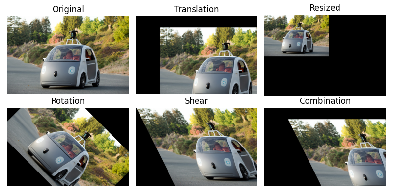
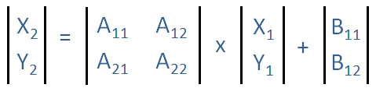
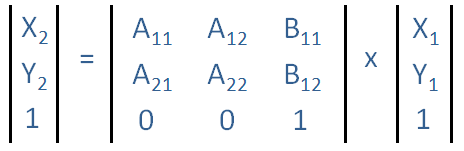

# Affine Transformation (仿射變換)

> A geometric transformation that preserves lines and parallelism

Affine transformation 是一種常見的幾何變換技術，它將影像中的像素通過`線性變換映射到新的位置`。仿射變換可以對影像進行`平移、旋轉、縮放、剪切`等操作，並且`保留了影像的直線性和平行性`，即變換後直線依然是直線，平行線依然平行。如下所示:




Affine transformation 通常用在*校正幾何失真(geometric distortions)或是變形(deformations)上*。

## Affine Transformation 的數學公式

Affine Transformation 是一種混合的線性二維幾何轉換，而混合的線性轉換包括：`位移`、`放大縮小`、`旋轉` 以及 `Shearing` 的操作。其通過一個線性變換矩陣將原始坐標轉換為新的坐標。該公式可用來描述影像的平移、旋轉、縮放和剪切等操作。仿射變換的特點是能保持影像的直線性和平行性。

General affine transformation 公式，以 (x1, y1) 為原本的位置，(x2, y2)為經過轉換後的位置，如下所示：




為了符合[線性轉換 (Linear Transformation)](https://zh.wikipedia.org/zh-tw/%E7%BA%BF%E6%80%A7%E6%98%A0%E5%B0%84) 的定義: $f(a+b) = f(a) + f(b)$，
將 Affine Transformation 以 homogenerous coordinates 來表示:




總結，仿射變換的公式可以寫成:

$$
\begin{bmatrix}
x' \\ y' \\ 1
\end{bmatrix}
=
\begin{bmatrix}
a & b & t_x \\
c & d & t_y \\
0 & 0 & 1
\end{bmatrix}
\begin{bmatrix}
x \\ y \\ 1
\end{bmatrix}
$$

### 仿射變換的矩陣分解

這個3x3矩陣中的每個元素都對應於不同的變換操作:

$$
\begin{bmatrix}
a & b & t_x \\
c & d & t_y \\
0 & 0 & 1
\end{bmatrix}
$$

- $a$ 和 $d$：控制影像的縮放或旋轉（在兩個方向上）。
- $b$ 和 $c$：控制影像的剪切。
- $t_x$ 和 $t_y$：控制影像的平移（x和y方向的移動）。

#### 平移 (Translation)

控制影像整體在 𝑥 和 𝑦 軸上的移動。

$$
\begin{bmatrix}
1 & 0 & t_x \\
0 & 1 & t_y \\
0 & 0 & 1
\end{bmatrix}
$$

```
tx specifies the displacement along the x axis
ty specifies the displacement along the y axis
```

#### 縮放 (Scaling / Resizing)

> Resizing is a specific type of affine transformation
>

在 𝑥 和 𝑦 軸上進行縮放。

$$
\begin{bmatrix}
s_x & 0 & 0 \\
0 & s_y & 0 \\
0 & 0 & 1
\end{bmatrix}
$$

其中，Sx 和 Sy 是水平方向和垂直方向的縮放因子。


```
sx specifies the scale factor along the x axis
sy specifies the scale factor along the y axis
```

#### 旋轉 (Rotation)

繞原點旋轉角度 𝜃。

$$
\begin{bmatrix}
\cos\theta & -\sin\theta & 0 \\
\sin\theta & \cos\theta & 0 \\
0 & 0 & 1
\end{bmatrix}
$$

### 剪切 (Shear)

對影像進行水平或垂直方向上的剪切。

$$
\begin{bmatrix}
1 & \tan\alpha & 0 \\
\tan\beta & 1 & 0 \\
0 & 0 & 1
\end{bmatrix}
$$

其中，α 和β 是水平方向和垂直方向上的剪切角度。

## Reference

1. [Self Driving Car Engineer Nanodegree](https://www.udacity.com/course/self-driving-car-engineer-nanodegree--nd013)

2. [Affine transformation - MATLAB & Simulink](https://www.mathworks.com/discovery/affine-transformation.html)

3. [Affine transformation @ 拾人牙慧](https://silverwind1982.pixnet.net/blog/post/160691705)


