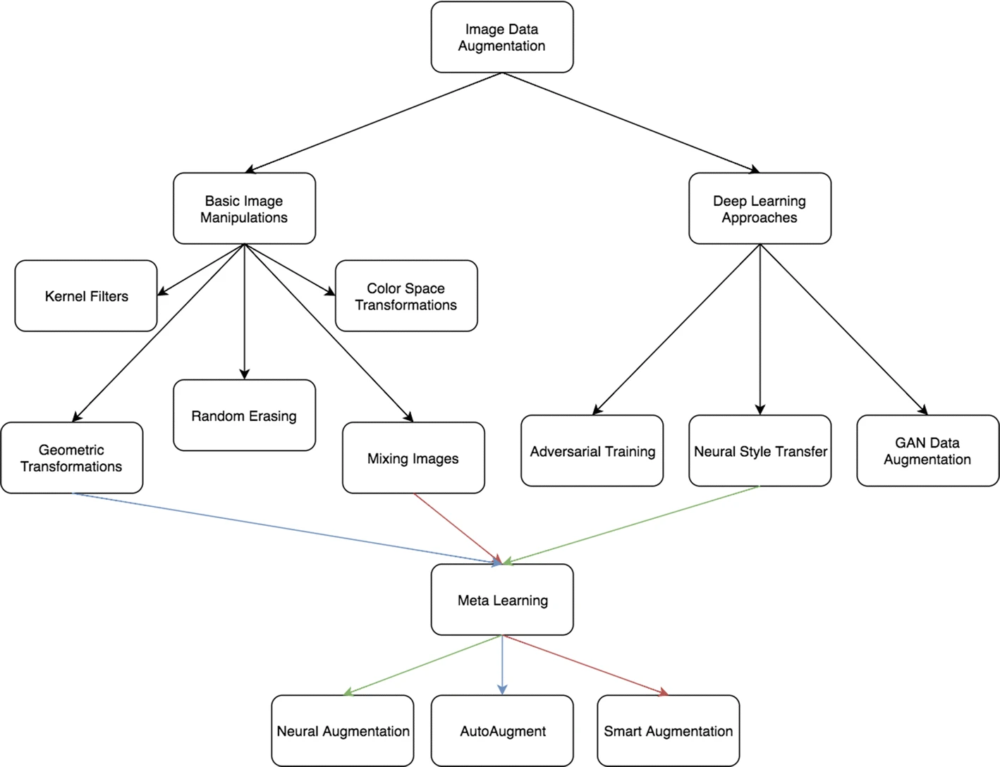

# Data Augmentation

Data Augmentation 是訓練模型中常見的方法，用來解決資料不足或是各類別資料不平均造成的問題。

在 [A survey on Image Data Augmentation for Deep Learning](https://journalofbigdata.springeropen.com/articles/10.1186/s40537-019-0197-0#Sec28) 這篇中將 data augmentation 主要分成兩大類:

- `Data warping`

    Data warping 改變現有的圖片，並且使用原始的 labels (保留原始 labels)。包含:

    - geometric and color transformations
    - random erasing
    - adversarial training
    - neural style transfer

- `Oversampling`

    Oversampling 則是合成新的圖片並將其添加到訓練集中。包含:
    - mixing images
    - feature space augmentations
    - generative adversarial networks (GANs)

而這兩者也可以互相搭配使用。接著我們對上面提到的各種方法，從實作的相似程度做簡單介紹。

## Image Data Augmentation techniques

### 1. Based on basic image manipulations

#### Geometric and Color space transformations

- Flipping
- Color space
- Cropping
- Rotation
- Translation
- Noise injection

#### Photometric transformations

- Kernel filters
- Mixing images
  - Mixup
  - CutMix
- Random erasing
  - Cutout

### 2. Based on Deep Learning

- Feature space augmentation

        在 Laten Space 操作。

- Adversarial training
- GAN-based Data Augmentation

## Reference

- [A survey on Image Data Augmentation for Deep Learning](https://journalofbigdata.springeropen.com/articles/10.1186/s40537-019-0197-0#Sec28)
- [Image Data Augmentation for Deep Learning: A Survey](https://arxiv.org/abs/2204.08610)
- [回顧Data Augmentation技巧](https://medium.com/learn-with-machine/paper-reading-a-survey-on-image-data-augmentation-for-deep-learning-b75bf3b3a688)
- [A survey on Image Data Augmentation 数据增强文献综述](https://zhuanlan.zhihu.com/p/76044027)
