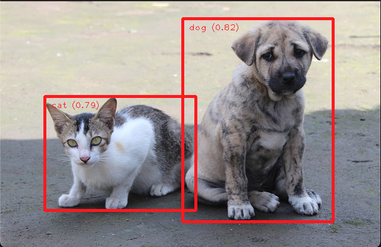

# Object Detection with MediaPipe Tasks

## Preparation

Download an off-the-shelf model. Check out the [MediaPipe documentation](https://developers.google.com/mediapipe/solutions/vision/object_detector#models) for more object detection models that you can use.

```bash
$ mkdir -p model
$ wget -q -O model/efficientdet.tflite -q https://storage.googleapis.com/mediapipe-tasks/object_detector/efficientdet_lite2_uint8.tflite
```

## Running inference and visualizing the results

```bash
$ python3 object_detector.py
```

Result:


