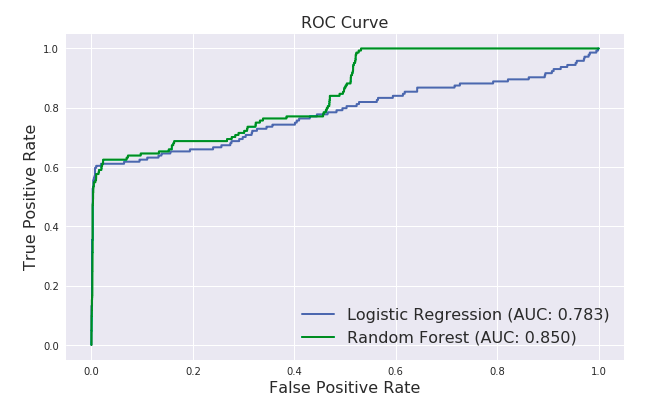

# Classification Metrics

## Confuion Matrix (混淆矩陣)

分類器的目的在對樣本進行分類，例如，將樣本中的男女進行區分。不過，在預測分類的過程中，會有預測正確與預測錯誤兩種結果。因此，將分類狀況與預測結果進行排列組合，即可得到以下四種情境:


|      |  Predict Positive  |  Predict Negative   |
| :--: | :--------: | :---------: |
|  Actual Positive  | True Positive (TP)  | False Negative (FN) |
|  Actual Negative  | False Positive (FP) | True Negative (TN)  |

## Accuracy, Precision, and Recall

> Recall 及 Precision 都適合用於`類別不平均的資料集`
>
> 因為在算式中並沒有考慮 True Negatives (TN)，只專注於正確判斷正樣本，因此，就算資料集中負樣本的數目遠大於正樣本，Recall 及 Precision 仍是有效的參考指標

### Accuracy (準確率)

所有預測為 True 的樣本佔總識別樣本的比例。

- 缺點: 類別比例不均時會影響評價效果


```
Acc = TP + TN / (TP + TN + FP + FN)
```

### Precision (精確率)

```
Precision = TP / (TP + FP)
```

為在所有預測為正樣本中，有多少實際為正樣本。 (`針對預測結果`)

### Recall (召回率; TPR; Sensitive)

> 就是 True Positive Rate (TPR), 又稱為敏感度 (Sensitive)

```
Recall = TP / (TP + FN)
```

表示在所有正樣本中，能夠預測到多少個正樣本。 (`針對原來的樣本`)

### 應用場景

#### 1. 當今天你加裝了一個人臉辨識的門鎖時，哪個指標比較重要呢？

```
Precision(精確率)比較重要，因為你不會希望別人的臉可以打開你家的鎖，判斷成正樣本就一定要是對的

Recall(召回率)低的話就只是常常無法判斷出你的臉，無法開門而已
```

#### 2. 廣告投放系統

```
Recall 比較重要，因為重視潛在客戶，我全都要 (實際正向客戶中我預測到多少個)

Precision 就沒那麼重要，不在意預測正向（廣告投出）答對多少
```

### 小結

通常在分類問題中，採用 `Top N` 返回結果的 Precision 和 Recall 來衡量模型的性能，表示為 `Precision@N` 和 `Recall@N`。

1. `Precision 高，Recall 低的模型`

    `謹慎的模型`, 雖然常常無法抓到，但只要有預測到的幾乎都是正確的

2. `Recall 高，Precision 低的模型`

    `寬鬆的模型`, 雖然有可能預測錯誤，但只要是該預測的都可以預測到

Precision 和 Recall 是相反的指標，當分類的 threshold 越高時，Presicion 提高但 Recall 降低，反之則 Precision 降低但 Recall 升高。魚與熊掌不可兼得，如果我們同時想要兼顧兩個指標怎辦呢？這時候就要看 `F1-score`了。

## F1-score (F1-Mesure)

> 他是`F-score`的一個特例，當`beta=1`時就是`F1-score`。

`F1-score` 是 recall 和 precision 的 加權調和平均數，顧名思義就是為了調和 recall 和 precision 之間增減反向的矛盾，對 recall 和 precision 進行加權調和，公式如下:

$$ F1 = 2 * \frac{Precision * Recall}{Precision + Recall}$$


`F1-score`最理想的數值是`趨近於1`，就是讓 precision 和 recall 都有很高的值。假設兩者皆為1，則`F1-score = 1 (100%)`，代表該演算法有著最佳的精確度

### F-score (F-Mesure)

公式如下:

$$ F = \frac{(1 + \beta^2) * Precision * Recall}{(\beta^2 * Precision) + Recall}$$


1. `beta=0`: 就是 Precision
3. `beta=1`: 就是 F1-score
2. `beta無限大`: 就是 Recall

所以當我想多看重一點 Precision 時，beta 就可以選小一點，當我想多看重 Recall 時，beta就可以選大一點。

## PR curve and ROC curve

- `PR curve`: 適合`類別不均`的情況

    因為是 Precision 與 Recall 並沒有考慮 TN，只專注於正確判斷正樣本，因此，就算資料集中負樣本的數目遠大於正樣本，Recall 及 Precision 仍是有效的參考指標

- `ROC curve`: 適合`類別平均`的情況

### PR Curve (Precision-Recall Curves, 精確召回曲線)

PR 曲線以 Recall 為 X 軸, Precision 為 Y 軸，每一個點代表設定不同的門檻值所得到的不同的 Recall 及 Precision，最後繪製成一條曲線。如下所示:


一般來說，Precision 與 Recall 越高，代表模型的效益越高，也就是 `PR 曲線越往右上方靠近越好`。

### ROC Curve (Receiver Operator Characteristic Curve, 接收器工作特性曲線)

ROC 曲線以 FPR (False Positive Rate) 為 X 軸, TPR (True Positive Rate) 為 Y 軸，每一個點代表設定不同的門檻值所得到的不同的 FPR 及 TPR ，最後繪製成一條曲。如下所示:



ROC 曲線呈現分類器在`效益（真陽性率）`與`成本（偽陽性率）`之間的相對關係。其中點（0,1）代表完美分類，代表效益最大，成本最低。所以`ROC 曲線越靠近左上方越好`。

#### FPR (False Positive Rate, 偽陽性率)

FPR 表示成 `1-特異度`。

   - 特異度(Specificity): 代表正確判斷負樣本的機率。

        ```
        特異度越高、FPR 越低，模型越能夠正確判斷負樣本、表現越好
        ```

公式如下:

```
Specificity = TN / (TN + FP)

FPR = 1 - Specificity
    = FP / (TN + FP)
```

#### TPR (True Positive Rate, 真陽性率)

TPR 又稱為`敏感度(Sensitivity)`，它也是我們熟知的`召回率(Recall)`，也就是正確判斷出正樣本的機率。

```
故 TPR 越高則模型越能夠正確判斷正樣本、表現越好
```

公式如下:

```
TPR = Sensitivity = Recall = TP / (TP + FN)
```

## AUC (Area under curve, 曲線下面積)

AUC（Area Under Curve）代表在ROC曲線下的面積，能表示分類器預測能力的一項常用的統計值。前面提到，ROC曲線越靠近左上方越好，因此，ROC曲線下的面積越大越好，代表模型的效益越高。

- AUC = 1: 是完美分類器。絕大多數預測的場合，不存在完美分類器。
- 0.5 < AUC < 1: 優於隨機猜測。這個分類器妥善設定閾值的話，能有預測價值。
- AUC = 0.5: 跟隨機猜測一樣（例：丟銅板），模型沒有預測價值。
- AUC < 0.5: 比隨機猜測還差；但只要進行反預測，就優於隨機猜測。


## Reference

- [行銷資料科學, 分類器評估方法 — ROC曲線、AUC、Accuracy、PR曲線](https://medium.com/marketingdatascience/%E5%88%86%E9%A1%9E%E5%99%A8%E8%A9%95%E4%BC%B0%E6%96%B9%E6%B3%95-roc%E6%9B%B2%E7%B7%9A-auc-accuracy-pr%E6%9B%B2%E7%B7%9A-d3a39977022c)
- [深入介紹及比較ROC曲線及PR曲線](https://medium.com/nlp-tsupei/roc-pr-%E6%9B%B2%E7%B7%9A-f3faa2231b8c)
