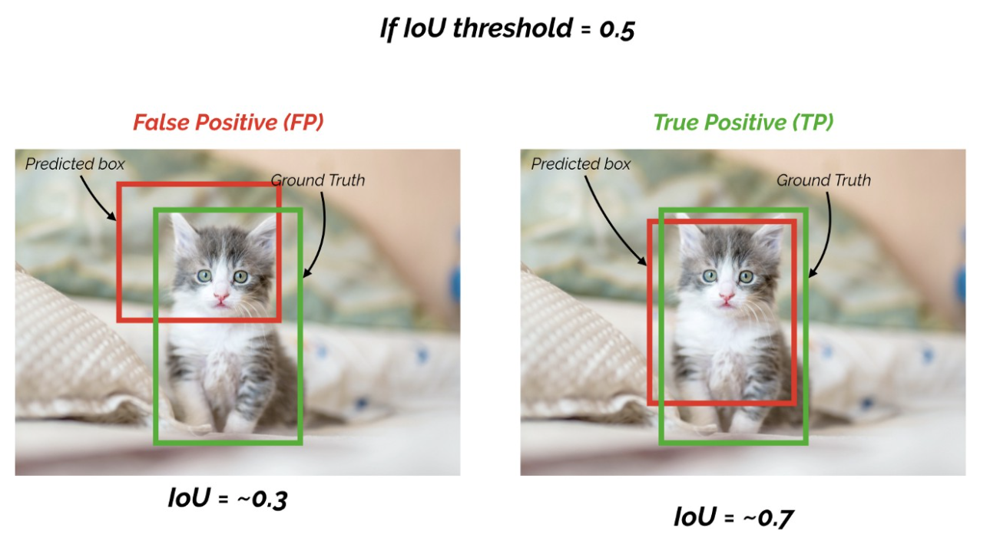

# Object Detection Metrics

## Precision and Recall

### Precision (準確率)

當模型預測為特定類別的目標物，有多少是正確的。 (`針對預測結果`)

```
Precision = TP / (TP + FP)
```

### Recall (召回率)

實際為目標物也確實被預測為目標物的比例。(`針對原來的樣本`)

```
Recall = TP / (TP + FN)
```

### Example


如上圖所示，圖片裡有4台汽車，但模型偵測出5台汽車

```
TP = 4
FP = 1
FN = 0

Precision = TP / (TP + FP) = 4 / 5
Recall = TP / (TP + FN) = 4 / 4 = 1
```

## F1-score (F1-Mesure)

他是`F-score`的一個特例，當`beta=1`時就是`F1-score`。

`F1-score`最理想的數值是`趨近於1`，就是讓precision和recall都有很高的值。

```
F1-score = 2 * ((Precision * Recall) / (Precision + Recall))
```

$$ F1 = 2 * \frac{Precision * Recall}{Precision + Recall}$$


假設兩者皆為1，則`F1-score = 1 (100%)`，代表該演算法有著最佳的精確度

## Intersection over Union (IoU)

`IoU` 簡單來說就就是評估預測的 `bounding box` 與 `ground truth box` 有多重疊(多像)，如下所示:


https://medium.com/curiosity-and-exploration/mean-average-precision-map-%E8%A9%95%E4%BC%B0%E7%89%A9%E9%AB%94%E5%81%B5%E6%B8%AC%E6%A8%A1%E5%9E%8B%E5%A5%BD%E5%A3%9E%E7%9A%84%E6%8C%87%E6%A8%99-70a2d2872eb0

### IoU and Precision and Recall

在 Onject Detection 的任務中，`我們可以透過 IoU 來計算 Precision 與 Recall，根據 IoU Threshold 判斷`，一般情況下，*如果 bounding box 被預測為確實有目標物存在，且 IoU 大於所設之threshold，我們就認定此 boundind box 為 True Positive (TP)，反之為 Flase Positive (FP)。*

For Example，假設 `IoU Threshold: 0.5`

1. IoU 0.7 -> TP
2. IoU 0.3 -> FP



現在針對 `IoU = 0.3` 的情況來看

1. IoU Threshold 0.5 -> FP
2. IoU Threshold 0.2 -> TP


所以 `IoU Threshold` 的選擇很重要！

```
有的設置 IoU Threshold 0.5，
也有的設置 IoU Threshold 0.7
```

## Average Precision (AP)

我們先來看看 Average Precision 的定義：

所謂的 `Average Precision (AP) 就是計算 Precision-Recall 曲線下的面積`。且由於 Precision 與 Recall 都是介於 0~1 之間的數值，因此 `AP 也是介於 0~1 之間的數值`。

### Example of AP

接下來讓我看一下例子 [2&3]:

假設偵測目標為車子且總共有8台，Ground Truth 與模型給出的預測如下所示:


1. 將結果`按照 Confidence 大小降序排序`，且 `IoU Threshold 為 0.5`，如下:

    

2. `針對每個預測，決定其是 TP or FP，並且計算 Precision 和 Recall`，如下:

    ```
    Rank 1:
      Precision = TP / (TP+FP) = 1/1 = 1
      Recall = TP / total P = 1/8 = 0.125
    Rank 2:
      Precision = 2/2 = 1
      Recall = 2/8 = 0.25
    Rank 3:
      Precision = 3/3 = 1
      Recall = 3/8 = 0.375
    Rank 4:
      Precision = 3/4 = 0.75
      Recall = 3/8 = 0.375
    Rank 5:
      Precision = 4/5 = 0.8
      Recall = 4/8 = 0.5
    Rank 6:
      Precision = 5/6 = 0.833
      Recall = 5/8 = 0.625
    Rank 7:
      Precision = 5/7 = 0.714
      Recall = 5/8 = 0.625
    Rank 8:
     Precision = 5/8 = 0.625
     Recall = 5/8 = 0.625
    Rank 9:
      Precision = 5/9 = 0.556
      Recall = 5/8 = 0.625
    Rank 10:
      Precision = 5/10 = 0.5
      Recall = 5/8 = 0.625
    ```

    畫出 `Precision-Recall` curve, 如下:

    

    可以發現到:
    - Recall 會隨著計算的 case 越多呈現越來越大的趨勢
    - Precision 則不一定，會根據 TP or FP 而一直跳動

3. `拉平曲線 (smooth the curve)`

    

    Graphically, at each recall level, we replace each precision value with the maximum precision value to the right of that recall level.

    

### Interpolated AP (PASCAL VOC Challenge before 2010)

PASCAL VOC is a popular dataset for object detection. For the PASCAL VOC challenge, a prediction is positive if IoU ≥ 0.5. Also, if multiple detections of the same object are detected, it counts the first one as a positive while the rest as negatives.

Pascal VOC2010之前將 Recall 分成 11 個點，分別為 `{0, 0.1, , …, 0.9, 1.0}`，並找出這幾個點的最大 Precision 作平均計算。


```
AP = (1+1+1+1+0.833+0.833+0.833+0+0+0+0) / 11 = 0.591
```

### Area under curve AUC AP (PASCAL VOC Challenge before 2010)

Instead of sampling 11 points, we sample p(rᵢ) whenever it drops and computes AP as the sum of the rectangular blocks.


This definition is called the `Area Under Curve (AUC)`. As shown below, as the interpolated points do not cover where the precision drops, both methods will diverge.


```
AP = 1*0.375 + 0.833*(0.625-0.375) = 0.583
```

## mean Average Precision (mAP)

`mean Average Precision (mAP)`就是針對每一個類別計算 AP ，之後再作平均就會得到 mAP。

但有些 dataset的 mAP 跟 AP 是一樣的，像 COCO dataset，所以須去了解各自 dataset 的 AP 與 mAP 定義。

*AP is averaged over all categories. Traditionally, this is called “mean average precision” (mAP). We make no distinction between AP and mAP (and likewise AR and mAR) and assume the difference is clear from context. [COCO Evaluation](https://cocodataset.org/#detection-eval)*

```
AP50: IoU threshold 0.5
AP75: IoU threshold 0.75
```

## Reference

1. [mAP (mean Average Precision) might confuse you!](https://towardsdatascience.com/map-mean-average-precision-might-confuse-you-5956f1bfa9e2)
2. [mean Average Precision (mAP) — 評估物體偵測模型好壞的指標](https://medium.com/curiosity-and-exploration/mean-average-precision-map-%E8%A9%95%E4%BC%B0%E7%89%A9%E9%AB%94%E5%81%B5%E6%B8%AC%E6%A8%A1%E5%9E%8B%E5%A5%BD%E5%A3%9E%E7%9A%84%E6%8C%87%E6%A8%99-70a2d2872eb0)
3. [Tommy Huang — 深度學習系列: 什麼是AP/mAP?](https://chih-sheng-huang821.medium.com/%E6%B7%B1%E5%BA%A6%E5%AD%B8%E7%BF%92%E7%B3%BB%E5%88%97-%E4%BB%80%E9%BA%BC%E6%98%AFap-map-aaf089920848)
4. [Jonathan Hui - mAP (mean Average Precision) for Object Detection](https://jonathan-hui.medium.com/map-mean-average-precision-for-object-detection-45c121a31173)
