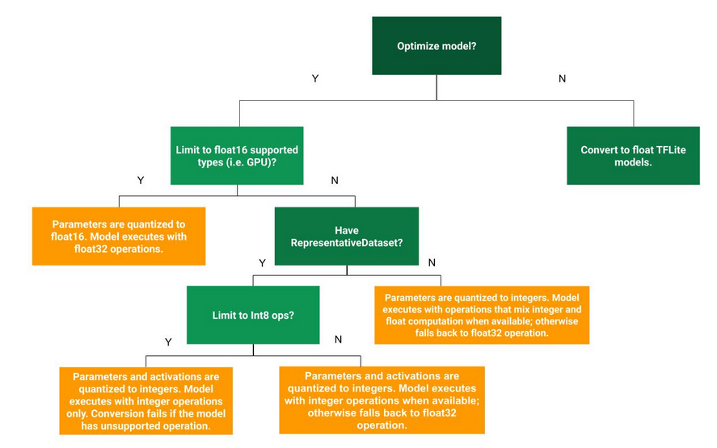

# 訓練後量化 (Post Training Quantization, PTQ)

`訓練後量化 (Post Training Quantization)` 是一種轉換技術，可以減少模型大小，同時還可以改善 CPU 和硬體加速器的延遲，且模型精度幾乎沒有下降。

## Optimization Methods

There are several post-training quantization options to choose from. Here is a summary table of the choices and the benefits they provide:

| 技術 | 好處 | 硬體 |
| :-: | :-: | :-: |
| Dynamic range quantization | 4x smaller, 2x-3x speedup | CPU |
| Full integer quantization | 4x smaller, 3x+ speedup | CPU, Edge TPU, Microcontrollers |
| Float16 quantization  | 2x smaller, GPU acceleration | CPU, GPU |

Tensorflow 提供了以下 decision tree 幫助我們判斷哪種量化方案最適合我們，如下:



### Dynamic range quantization

- 轉換時:

    `將權重從浮點靜態量化 (statucally quantizes) 為整數 (8-bits of precision)`

- 推理時:

    會根據其範圍`動態量化 activation functions` 為 8-bits，並且用 8-bits 的權重和激活函數進行計算。

此種量化方法:

- 減少記憶體使用並加快計算速度，而無需提供有代表性的數據集進行校正。
- 提供了接近 `fully fixed-point` inferences 的 latencies。

    然而，輸出仍然使用浮點數儲存，因此此法運算速度的提升仍小於 `full fixed-point` 所提升的。

###### TFLite Example:

```python
converter = tf.lite.TFLiteConverter.from_saved_model(saved_model_dir)
converter.optimizations = [tf.lite.Optimize.DEFAULT]
tflite_quant_model = converter.convert()
```

###### PyTorch Example:

```python
quantized_model = torch.quantization.quantize_dynamic(model, {需要量化的layer}, dtype=torch.qint8)
```


## Reference

- [Tensorflow/Post-training quantization](https://www.tensorflow.org/lite/performance/post_training_quantization)
