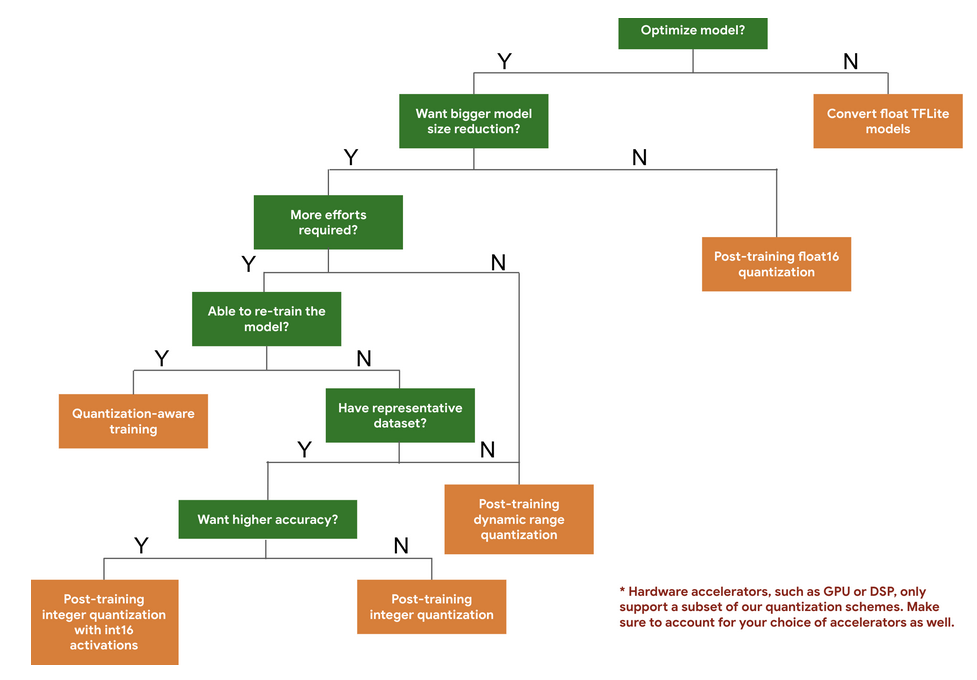

# Model Optimization

## Types of optimzation

- Quantization
- Pruning
- Clustering
- Knowledge Distillation

### 量化 (Quantization)

量化的工作原理是降低用於表示模型參數的數字 (默認情況下是 32 位浮點數) 的精度，默認情況下是 32 位浮點數。 這樣可以獲得較小的模型和更快的計算。

#### Types of quantization

分為以下兩種:

- `訓練後量化 (Post Training Quantization)`
- `量化感知訓練 (Quantization Aware Training)`

TensorFlow Lite 提供以下量化類型:

| Technique | Data requirements | Size reduction | Accuracy | Supported hardware |
| :-: | :-: | :-: | :-: | :-: |
| [Post-training float16 quantization](https://www.tensorflow.org/lite/performance/post_training_float16_quant) | No data | Up to 50% | Insignificant accuracy loss | CPU, GPU |
| [Post-training dynamic range quantization](https://www.tensorflow.org/lite/performance/post_training_quant) | No data | Up to 75% | Smallest accuracy loss | CPU, GPU (Android) |
| [Post-training integer quantization](https://www.tensorflow.org/lite/performance/post_training_integer_quant) | Unlabelled representative sample | Up to 75% | Small accuracy loss | CPU, GPU (Android), EdgeTPU, Hexagon DSP |
| [Quantization-aware training](https://www.tensorflow.org/model_optimization/guide/quantization/training) | Labelled training data | Up to 75% | Smallest accuracy loss | CPU, GPU (Android), EdgeTPU, Hexagon DSP |

Tensorflow 提供了以下 decision tree 幫助我們依據預期的 model size 和 accuracy 來選擇量化方案，如下:

### 剪枝 (Pruning)

[Pruning](https://www.tensorflow.org/model_optimization/guide/pruning) works by removing parameters within a model that have only a minor impact on its predictions. Pruned models are the same size on disk, and have the same runtime latency, but can be compressed more effectively. This makes pruning a useful technique for reducing model download size.

模型剪枝的目標是只保留重要的權重、參數，希望模型保持相同的性能、效果，同時可以降低計算成本，並且也減少了模型的儲存空間，另外在開發時，還可以加速訓練過程。基本的模型剪枝原理就是去掉權重中不重要的值，以深度學習模型為例，就是減少神經網路層之間的連接數量，這樣就可以減少計算中涉及的參數，從而降低計算次數，如此會碰到的問題就是模型的表現會降低，所以模型剪枝可以說是模型參數量及模型的表現之間的交易（trade-off）。

### Clustering

[Clustering](https://www.tensorflow.org/model_optimization/guide/clustering) works by `grouping the weights` of each layer in a model into a predefined number of clusters, then sharing the centroid values for the weights belonging to each individual cluster. This reduces the number of unique weight values in a model, thus reducing its complexity.

As a result, clustered models can be compressed more effectively, providing deployment benefits similar to pruning.

### 知識蒸餾 (Knowledge Distillation)

Knowledge Distillation is a procedure for model compression, in which a small (student) model is trained to match a large pre-trained (teacher) model. Knowledge is transferred from the teacher model to the student by minimizing a loss function, aimed at matching softened teacher logits as well as ground-truth labels.

The logits are softened by applying a "temperature" scaling function in the softmax, effectively smoothing out the probability distribution and revealing inter-class relationships learned by the teacher.

知識蒸餾是訓練一個小型（學生）模型以匹配一個大型預訓練（教師）模型。 通過最小化損失函數，讓知識從教師模型轉移到學生。

- 知識蒸餾主要運用在分類任務上

## Reference

- [Tensorflow/Model optimization](https://www.tensorflow.org/lite/performance/model_optimization)
