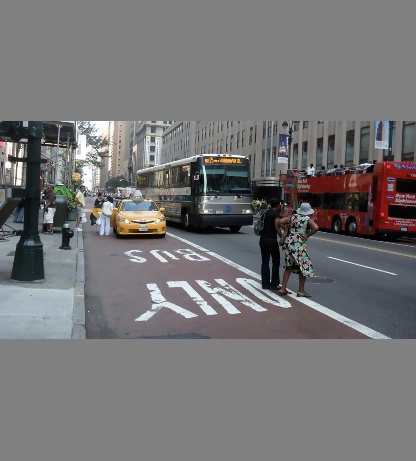

# Resize image and Keep Its Aspect Ratio

Resizing image, keeping the `aspect ratio consistent`, and padding the left out areas with the color (128,128,128)

## Usage

```bash
$ python3 resize.py
```

## Result

Origin


Resized

