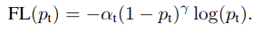
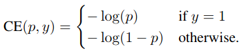
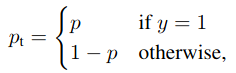
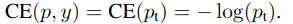

# Focal Loss for Dense Object Detection

Paper: [Focal Loss for Dense Object Detection](https://arxiv.org/pdf/1708.02002.pdf)


## Usage

```bash
$ python main.py
```

## Focal Loss Definioion



### Cross Entropy



We define $p_t$:



Then:


